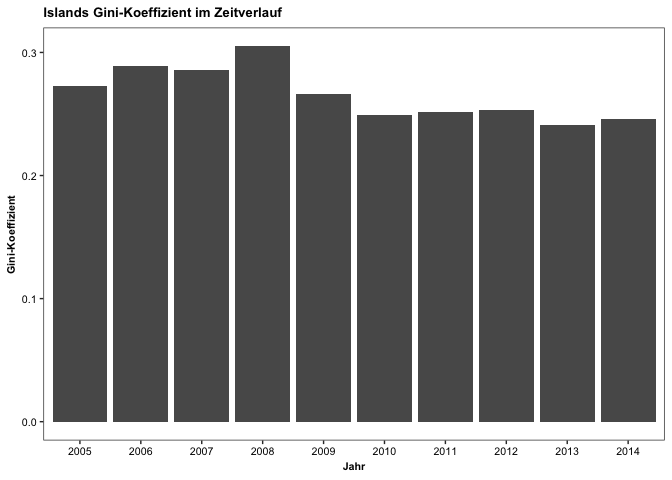
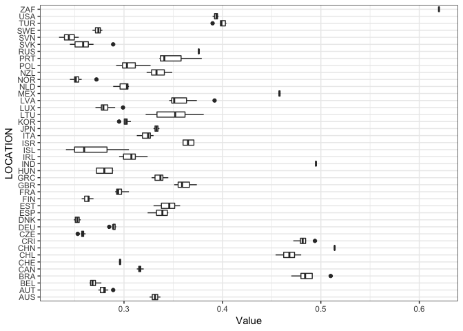
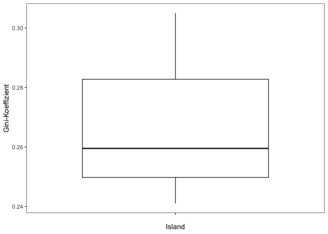
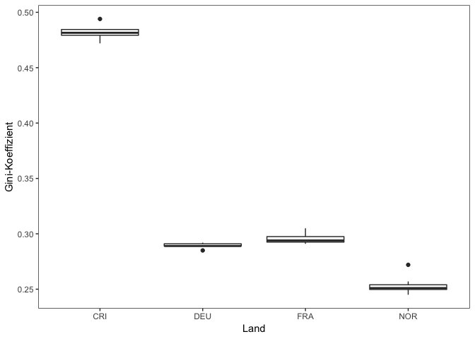

Income Inequality Solution
================

The gap between rich and poor keeps widening. Growth, if any, has disproportionally benefited higher income groups while lower income households have been left behind. This long-run increase in income inequality not only raises social and political concerns, but also economic ones.

In this problem set, we use the latest OECD data on income inequality to check wether the previous statemts can be confirmned.

*Income* is defined as household disposable income in a particular year. It consists of earnings, self-employment and capital income and public cash transfers; income taxes and social security contributions paid by house-holds are deducted. The income of the household is attributed to each of its members, with an adjustment to reflect differences in needs for households of different sizes.

Income inequality among individuals is measured here by the **Gini coefficient**. The Gini coefficient is based on the comparison of cumulative proportions of the population against cumulative proportions of income they receive, and it ranges between 0 in the case of perfect equality and 1 in the case of perfect inequality.

Source: OECD (2018), Income inequality (indicator). doi: 10.1787/459aa7f1-en (Accessed on 10 April)\[2018)<https://data.oecd.org/inequality/income-inequality.htm>\]

1) Descriptive Statistics
-------------------------

Load the dataset "oecd" from GitHub and get familiar with the variables.

``` r
library(readr)
dataset_oecd <- read_csv("https://raw.githubusercontent.com/kirenz/datasets/master/oecd.csv")
```

    ## Parsed with column specification:
    ## cols(
    ##   LOCATION = col_character(),
    ##   INDICATOR = col_character(),
    ##   SUBJECT = col_character(),
    ##   MEASURE = col_character(),
    ##   FREQUENCY = col_character(),
    ##   TIME = col_double(),
    ##   Value = col_double(),
    ##   `Flag Codes` = col_character()
    ## )

\*Tasks: a) Drop the following variables: INDICATOR, SUBJECT, MEASURE, FREQUENCY, Flag Codes. If necessary, convert variables. b) Identifiy and report (value, country and year) the lowest and highest Gini value in the dataset. c) Identifiy the country with the highest variation in the Gini coefficient (hint: use interquartile range) and create a barplot (with x=TIME). d) Select all data with a Gini coefficient value lower than 0.245 an save the data as a new dataframe (gini\_lower). e) Calculate the mean, median, standard deviation and interquartile range for locations: Germany (DEU), Norway (NOR), France (FRA) and Costa Rica (CRI) and interpret your findings f) Create a Boxplot for: 1) All countries 2) only the country with the highest variation 3) the countries fromn e) (in one plot)

### 1a)

``` r
dataset_oecd <- dataset_oecd[-c(2,3,4,5,8)]
dataset_oecd$TIME <- as.factor(dataset_oecd$TIME)
print(dataset_oecd)
```

    ## # A tibble: 269 x 3
    ##    LOCATION TIME  Value
    ##    <chr>    <fct> <dbl>
    ##  1 AUS      2012  0.326
    ##  2 AUS      2014  0.337
    ##  3 AUT      2007  0.284
    ##  4 AUT      2008  0.281
    ##  5 AUT      2009  0.289
    ##  6 AUT      2010  0.28 
    ##  7 AUT      2011  0.281
    ##  8 AUT      2012  0.275
    ##  9 AUT      2013  0.279
    ## 10 AUT      2014  0.274
    ## # ... with 259 more rows

### 1b)

``` r
library(dplyr)
```

    ## 
    ## Attaching package: 'dplyr'

    ## The following objects are masked from 'package:stats':
    ## 
    ##     filter, lag

    ## The following objects are masked from 'package:base':
    ## 
    ##     intersect, setdiff, setequal, union

``` r
gini_max <- dataset_oecd %>% filter(Value == max(Value))
gini_min <- dataset_oecd %>% filter(Value == min(Value))
print(gini_max)
```

    ## # A tibble: 1 x 3
    ##   LOCATION TIME  Value
    ##   <chr>    <fct> <dbl>
    ## 1 ZAF      2015   0.62

``` r
print(gini_min)
```

    ## # A tibble: 1 x 3
    ##   LOCATION TIME  Value
    ##   <chr>    <fct> <dbl>
    ## 1 SVN      2008  0.234

### 1c)

``` r
library(dplyr)
variation_max <- dataset_oecd %>% 
  group_by(LOCATION) %>% 
  summarize(IQR_max = IQR(Value)) %>% 
  filter(IQR_max == max(IQR_max))
print(variation_max)
```

    ## # A tibble: 1 x 2
    ##   LOCATION IQR_max
    ##   <chr>      <dbl>
    ## 1 ISL       0.0330

``` r
library(dplyr)
library(ggplot2)

var_max_plot <- dataset_oecd %>% filter(LOCATION == "ISL")

ggplot(var_max_plot) +
  geom_bar(stat = 'identity', aes(x=as.character(TIME), y=Value)) +
  theme_bw() +
        theme(axis.text.x = element_text(angle = 0, size = 8, family="Arial", colour='black'),
        axis.text.y = element_text(angle = 0, size = 8, family="Arial", colour='black'),
        axis.title = element_text(size=8, face="bold", family="Arial", colour='black'),
        panel.grid.major = element_blank(),
        panel.grid.minor = element_blank(),
        plot.title=element_text(hjust=0, size=10,  family="Arial", face="bold", colour='black')) +
  labs(x= "Jahr", y="Gini-Koeffizient", title = "Islands Gini-Koeffizient im Zeitverlauf")
```



### 1d)

``` r
library(dplyr)
gini_lower <- dataset_oecd %>% filter(Value<0.245)
print(gini_lower)
```

    ## # A tibble: 7 x 3
    ##   LOCATION TIME  Value
    ##   <chr>    <fct> <dbl>
    ## 1 ISL      2013  0.241
    ## 2 SVN      2005  0.24 
    ## 3 SVN      2006  0.237
    ## 4 SVN      2007  0.239
    ## 5 SVN      2008  0.234
    ## 6 SVN      2010  0.244
    ## 7 SVN      2011  0.244

### 1e)

``` r
library(dplyr)
oecd_group <- dataset_oecd %>% filter(LOCATION == "DEU" | LOCATION == "NOR" | LOCATION == "FRA" | LOCATION == "CRI" ) 

oecd_group_stats <- oecd_group %>% 
  group_by(LOCATION) %>% 
  summarize(median = mean(Value, na.rm =TRUE), median(Value, na.rm=TRUE), sd(Value, na.rm = TRUE), IQR(Value, na.rm =TRUE))

print(oecd_group_stats)
```

    ## # A tibble: 4 x 5
    ##   LOCATION median `median(Value, na.… `sd(Value, na.rm … `IQR(Value, na.r…
    ##   <chr>     <dbl>               <dbl>              <dbl>             <dbl>
    ## 1 CRI       0.482               0.482            0.00731           0.00525
    ## 2 DEU       0.289               0.289            0.00268           0.002  
    ## 3 FRA       0.296               0.294            0.00622           0.005  
    ## 4 NOR       0.254               0.251            0.00823           0.00425

### 1f) 1. Boxplot all

``` r
library(ggplot2)
ggplot(dataset_oecd) +
  geom_boxplot(aes(x=LOCATION, y=Value)) +
  coord_flip() +
  theme_bw() 
```



### f) 2. Boxplot highest Variation

``` r
ggplot(var_max_plot) +
  geom_boxplot(aes(x='', y=Value)) +
  theme_bw() +
  theme(panel.grid.major = element_blank(),
        panel.grid.minor = element_blank()) +
  labs(x="Island", y = "Gini-Koeffizient")
```



### 1f) 3. Boxplot countries from e)

``` r
library(ggplot2)
ggplot(oecd_group) +
  geom_boxplot(aes(x=LOCATION, y=Value)) +
  theme_bw() +
  theme(panel.grid.major = element_blank(),
        panel.grid.minor = element_blank()) +
  labs(x="Land", y = "Gini-Koeffizient")
```


